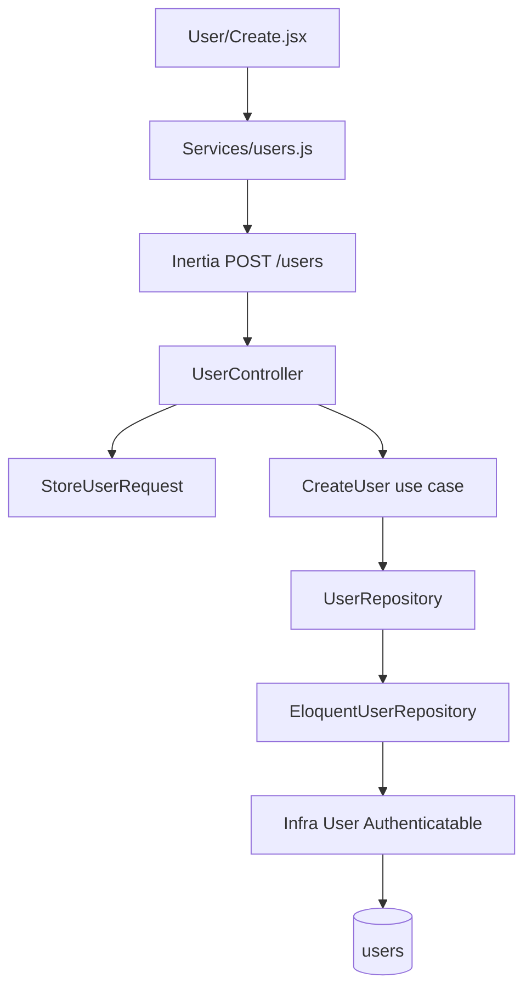

# Create User Design

**Spec**: `.specs/features/create-user/spec.md`
**Status**: Approved (contrato travado por `docs/tree.md`, `docs/architecture.md` e ADR-002)

---

## Architecture Overview

Criação de usuário é o módulo `app/Modules/User`. Domain é PHP puro. Application só orquestra persistência. Infra tem Eloquent, hash Argon, HTTP (controller + Form Request) e a página Inertia de create.

Validação de input e unicidade de email ficam no Form Request do controller, não no use case.



Direção: Infra → Application → Domain. Domain não importa Illuminate.

---

## Code Reuse Analysis

### Existing Components to Leverage

| Component | Location | How to Use |
| --------- | -------- | ---------- |
| `HasUuids` | Laravel 12 | Trait no modelo Infra; gera UUIDv7 |
| Cast `hashed` | Eloquent | Hash via `HASH_DRIVER=argon`; modelo não chama hasher próprio |
| `SoftDeletes` | Eloquent | `deleted_at`; `withTrashed()` no `existsByEmail` |
| `Authenticatable` | Laravel Auth | Modelo Infra continua autenticável (RNF07) |
| `UserFactory` | `database/factories/UserFactory.php` | Aponta para o modelo Infra; sem `email_verified_at` |
| Unique `users.email` | migration atual | Mantém; adiciona `softDeletes()` |
| Testes Feature atuais | `tests/Feature/User/` | Reescrever contra o use case e erros de Application |

### Integration Points

| System | Integration Method |
| ------ | ------------------ |
| Auth Eloquent | `config/auth.php` `providers.users.model` = modelo Infra |
| Hash | `HASH_DRIVER=argon` em `.env.example` e `phpunit.xml`; não publicar `config/hashing.php` |
| Container | `AppServiceProvider` faz bind de `UserRepository` |

---

## Components

### User (Domain entity)

- **Purpose**: Estado do agregado usuário depois de persistido
- **Location**: `app/Modules/User/Domain/Entities/User.php`
- **Interfaces**:
  - `__construct(id, name, email, passwordHash, rememberToken, createdAt, updatedAt, deletedAt)` - dados já persistidos; sem senha em texto puro
- **Dependencies**: nenhum (PHP puro)
- **Reuses**: contrato de colunas do ADR-002

### UserRepository

- **Purpose**: Contrato de persistência do agregado
- **Location**: `app/Modules/User/Domain/Repositories/UserRepository.php`
- **Interfaces**:
  - `existsByEmail(string $email): bool` - inclui soft-deleted
  - `create(string $name, string $email, string $password): User` - grava, hasheia na Infra, devolve entidade
- **Dependencies**: entidade `User`
- **Reuses**: nenhum

### CreateUser (Application)

- **Purpose**: Persistir usuário já validado
- **Location**: `app/Modules/User/Application/UseCases/CreateUser.php`
- **Interfaces**:
  - `execute(string $name, string $email, string $password): User` - só chama o repositório
- **Dependencies**: `UserRepository`
- **Reuses**: nenhum

### StoreUserRequest

- **Purpose**: Validar HTTP (required, email, password min 8, unique na tabela `users`)
- **Location**: `app/Modules/User/Infra/Http/Requests/StoreUserRequest.php`
- **Interfaces**:
  - `rules(): array`
  - `validated(): array{name: string, email: string, password: string}`
- **Dependencies**: Laravel Form Request; `Password::defaults()`; `Rule::unique('users', 'email')`
- **Reuses**: RNF08 / RNF14

### UserController

- **Purpose**: Adaptar HTTP ao use case
- **Location**: `app/Modules/User/Infra/Http/Controllers/UserController.php`
- **Interfaces**:
  - `create(): Response` - Inertia `User/Create`
  - `store(StoreUserRequest, CreateUser): RedirectResponse`
- **Dependencies**: Inertia; Form Request; use case
- **Reuses**: `App\Http\Controllers\Controller`

Não criar `Index.jsx` / `Edit.jsx` / `Hooks/` vazios.

### User (Infra Eloquent)

- **Purpose**: Persistência e auth Laravel
- **Location**: `app/Modules/User/Infra/Database/Models/User.php`
- **Interfaces**:
  - Eloquent `Authenticatable` com `HasUuids`, `SoftDeletes`, `Notifiable`, `HasFactory`
  - `$fillable`: `name`, `email`, `password`
  - `casts`: `password` => `hashed`
- **Dependencies**: Laravel
- **Reuses**: traits do framework; factory existente

### EloquentUserRepository

- **Purpose**: Implementa `UserRepository` com Eloquent
- **Location**: `app/Modules/User/Infra/Database/Repositories/EloquentUserRepository.php`
- **Interfaces**:
  - `existsByEmail` usa `withTrashed()`
  - `create` usa `User::query()->create` e mapeia para a entidade de Domain
- **Dependencies**: modelo Infra; interface Domain
- **Reuses**: cast `hashed`, `HasUuids`

### AppLayout / User Create page / users service

- **Purpose**: UI Inertia da criação; service isola `router.post`
- **Location**: `resources/js/Layouts/AppLayout.jsx`, `resources/js/Pages/User/Create.jsx`, `resources/js/Services/users.js`
- **Dependencies**: `@inertiajs/react`
- **Reuses**: Tailwind

---

## Data Models

### users (persistência)

```text
id            uuid PK          -- HasUuids / UUIDv7
name          string
email         string unique    -- vale também para soft-deleted
password      string           -- Argon2i via HASH_DRIVER=argon
remember_token string nullable -- sessão Laravel; nulo na criação
created_at    timestamp
updated_at    timestamp
deleted_at    timestamp nullable
```

**Relationships**: nenhuma nesta feature. `sessions.user_id` já é `foreignUuid`.

### User (Domain)

```text
id: string
name: string
email: string
passwordHash: string
rememberToken: string|null
createdAt: DateTimeImmutable|null
updatedAt: DateTimeImmutable|null
deletedAt: DateTimeImmutable|null
```

---

## Error Handling Strategy

| Error Scenario | Handling | User Impact |
| -------------- | -------- | ----------- |
| name/email/password vazio | Form Request 422 / session errors | Formulário reexibe erros |
| email inválido | Form Request chave `email` | Não persiste |
| password < 8 | Form Request chave `password` | Não persiste |
| email já existe (ativo ou soft-deleted) | Form Request `unique:users,email` | Não persiste; unique do banco é a rede de concorrência |
| `email_verified_at` no input | Ignorado; create só recebe name/email/password | Sem coluna extra |

---

## Risks & Concerns

| Concern | Location (file:line) | Impact | Mitigation |
| ------- | -------------------- | ------ | ---------- |
| Auth aponta para `App\Models\User` | `config/auth.php:67` | Login futuro usa modelo errado | Atualizar `providers.users.model` para o modelo Infra |
| Action atual fura a arquitetura | `app/Actions/CreateUser.php:1` | Camada e erros errados (ValidationException) | Remover Action; use case + Application Errors |
| Migration sem `deleted_at` | `database/migrations/0001_01_01_000000_create_users_table.php:14` | ADR-002 não cumprido | `$table->softDeletes()` na mesma migration (ainda sem produção) |
| Default bcrypt | `.env.example` sem `HASH_DRIVER` | Hash fora do ADR-002 | `HASH_DRIVER=argon` em `.env.example` e `phpunit.xml` |
| Unique + soft delete | ADR-002 | Email de usuário apagado não pode ser recadastrado | Comportamento aceito; `existsByEmail` usa `withTrashed()` |
| Nome `User` em Domain e Infra | novo módulo | Colisão de import | Alias do Eloquent como `UserModel` no repositório |

---

## Tech Decisions (only non-obvious ones)

| Decision | Choice | Rationale |
| -------- | ------ | --------- |
| Onde hashear | Cast `hashed` no modelo Infra | ADR-002; Domain não importa Illuminate |
| Onde validar | Form Request do controller | Decisão do usuário; use case só persiste |
| Bind do repositório | `AppServiceProvider` | Um bind; provider extra não se justifica |
| HTTP | Inertia `GET /users/create` + `POST /users` | `docs/tree.md` + ADR-003 |
| Unique no Form Request | `Rule::unique('users', 'email')` na tabela | Inclui soft-deleted; unique no Model ignoraria trash |
| `config/hashing.php` | Não publicar | ADR-002 usa defaults do framework; só `HASH_DRIVER=argon` |
